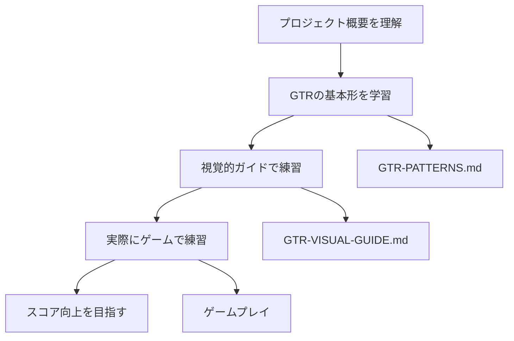

# ドキュメント一覧

GTRトレーニングツールのドキュメントです。

## 📚 ドキュメント構成

### 🎯 プロジェクト概要
- [REQUIREMENT.md](../REQUIREMENT.md) - 要件定義書（全体仕様）
- [ARCHITECTURE.md](../ARCHITECTURE.md) - 技術設計書
- [TECH_RECOMMENDATION.md](../TECH_RECOMMENDATION.md) - 技術選定の詳細と理由

### 🎮 GTR学習ガイド
- [GTR-PATTERNS.md](./GTR-PATTERNS.md) - GTRパターン定義（技術仕様）
- [GTR-VISUAL-GUIDE.md](./GTR-VISUAL-GUIDE.md) - GTR視覚的ガイド（学習用）
- [layout-design.md](./layout-design.md) - レイアウト設計書

### 💻 開発者向け
- [CLAUDE.md](../CLAUDE.md) - Claude Code 開発ガイド

## 🎯 GTR習得の流れ

## 📖 学習者向け推奨読書順序

### 1. 🎯 まず概要を掴む
1. [README.md](../README.md) - プロジェクト全体の説明
2. [REQUIREMENT.md](../REQUIREMENT.md) - どんなツールなのか

### 2. 📚 GTRを学ぶ
1. [GTR-VISUAL-GUIDE.md](./GTR-VISUAL-GUIDE.md) - **まずここから！** 図解で分かりやすく説明
2. [GTR-PATTERNS.md](./GTR-PATTERNS.md) - より詳細な技術仕様

### 3. 🎮 実践する
1. ゲームを起動して実際に練習
2. スコア向上を目指す

## 🛠️ 開発者向け推奨読書順序

### 1. プロジェクト理解
1. [REQUIREMENT.md](../REQUIREMENT.md) - 要件定義
2. [ARCHITECTURE.md](../ARCHITECTURE.md) - 技術設計
3. [CLAUDE.md](../CLAUDE.md) - 開発ガイド

### 2. GTRロジック理解
1. [GTR-PATTERNS.md](./GTR-PATTERNS.md) - パターン定義
2. `src/game/GTRPatterns.ts` - 実装コード

### 3. 実装・拡張
1. 既存コードの理解
2. 新機能の開発
3. テスト・デバッグ

## 📋 GTR対応状況

| GTRタイプ | 対応状況 | 難易度 | 説明 |
|-----------|----------|--------|------|
| 標準GTR | ✅ 対応 | ⭐⭐ | 2-3列目中心の基本形 |
| 折り返しGTR | ✅ 対応 | ⭐⭐⭐ | 1列目を含む発展形 |
| 逆折りGTR | ❌ 対象外 | ⭐⭐⭐⭐⭐ | 複雑すぎるため除外 |
| 変則GTR | ❌ 対象外 | ⭐⭐⭐⭐ | 基本習得を優先 |

## 🎨 ドキュメント記号の意味

### ステータス
- ✅ 完了・対応済み
- 🚧 開発中・部分対応
- ❌ 対象外・未対応
- 📋 計画中

### 重要度・難易度
- ⭐ 簡単・基本
- ⭐⭐ 普通
- ⭐⭐⭐ 難しい・発展
- ⭐⭐⭐⭐ とても難しい
- ⭐⭐⭐⭐⭐ 超上級者向け

### アイコン
- 🎯 目標・概要
- 📚 学習・ドキュメント
- 🎮 ゲーム・実践
- 💻 開発・技術
- 🎨 デザイン・UI
- 📊 データ・統計

## 🔄 ドキュメント更新履歴

- **2024-08-08**: 
  - GTR-PATTERNS.md 作成
  - GTR-VISUAL-GUIDE.md 作成
  - docs/README.md 作成
  - 逆折りGTRを対象外に変更

---

質問や改善提案がありましたら、GitHubのIssuesでお知らせください。